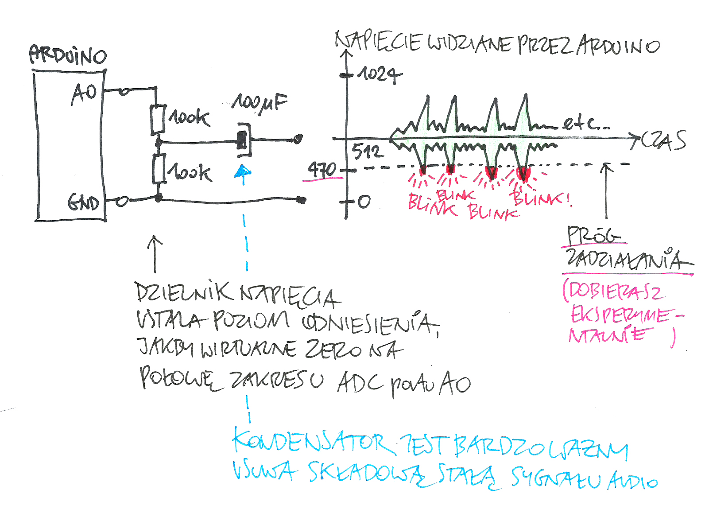

## PROSTY TRIGGER AUDIO

1.podawany sygnał dostosować korektorem graficznym / filtrem tak, aby uwypuklić 
pasmo, które ma triggerować układ  
2.sygnał podać przez kondensator okolo 100uF na dzielnk napiecia 100k/100k rozpiety miedzy GND i A0  
3.czułość ukladu to odstępstwo od zera wejścia A0, w zakresie od połowy 
rozdzielczości przetwornika do - jak mi wyszło z testów - odchyłki około +/- 100 
czyli 1023/2=ca.512  np. 400-512 lub 512-612  
-490 to czułość bardzo duża  
-470 to czułość średna  
-400 to czułość bardzo niska

